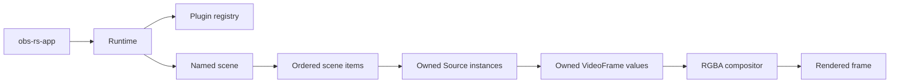

# OBS-RS Architecture

## Status and scope

This document describes the architecture being implemented in this repository. It
is a clean-room Rust design for an OBS-like engine; it does not describe the current
implementation of the existing OBS application.

## Layered workspace

```text
obs-rs-app
├── obs-rs-core ─── obs-rs-builtins ─── obs-rs-plugin-api
├── obs-rs-clock ─── obs-rs-audio ─── obs-rs-media
│                └── obs-rs-video ─── obs-rs-media
├── obs-rs-output ─── obs-rs-audio / obs-rs-media
├── obs-rs-project ─── obs-rs-config / obs-rs-media
├── obs-rs-diagnostics ─── standalone bounded recovery format
├── obs-rs-ui ─── obs-rs-project / obs-rs-media
└── obs-rs-render ─── obs-rs-media

obs-rs-gui ────── obs-rs-ui / obs-rs-project / obs-rs-media
obs-rs-capture ─── obs-rs-media
obs-rs-util ────── shared validation values
```

The dependency direction is one-way. Value types live in small crates; the runtime
owns orchestration; the application chooses a plugin set and a user-facing entry
point. No crate reaches into another crate's private state.

## Runtime ownership

`obs-rs-core::Runtime` owns the registry, source instances, named scenes, and scene
item ordering. A source is created by a registered Rust `SourceFactory` and is
stored as a boxed `Source` trait object. The caller receives a typed `SourceId`, not
an address or a globally shared pointer.

The runtime is currently single-threaded by design. This makes lifecycle and
borrowing behavior explicit while the media clock and worker model are specified.
Threaded execution is a later phase and must preserve the same ownership contracts.

## Media model

`obs-rs-media` owns the first portable media values, while `obs-rs-video` and
`obs-rs-audio` own the first transport/mix primitives:

- `Timestamp` is an integer nanosecond position;
- `FrameRate` is a validated rational number;
- `VideoFormat` describes dimensions and frame rate;
- `PixelFormat` and `RawVideoFrame` validate packed RGBA/BGRA/RGB/gray and planar
  I420 buffers before conversion;
- `VideoFrame` owns a tightly packed RGBA8 buffer;
- frame composition validates format and buffer invariants before blending.
- `FrameQueue` bounds memory and makes frame drops observable;
- `VideoScheduler` calculates rational timestamps without floating-point drift;
- `MonotonicClock`, `VideoClock`, `VideoPacer`, and `DeadlineObservation` provide
  injectable wall-clock pacing without changing deterministic scheduler tests;
- `VideoPipeline` combines the two for callback-driven rendering and exposes
  produced/empty/drop/deadline metrics.
- `VideoWorker` layers injected-clock pacing, cancellation checks, post-render
  deadline observation, wait/render timing, and output draining over the pipeline.
- `VideoPipeline::run_sustained` provides a bounded output-draining fixture for
  repeatable scene throughput and queue-pressure measurements.
- `FrameFilter` provides deterministic grayscale, brightness, and opacity effects;
  the runtime stores an ordered filter chain per scene item.
- `FrameTransition` and `Runtime::render_scene_transition` provide cut and
  cross-fade behavior, including transparent fade-in/fade-out handling.
- `CompositorMetrics` reports render calls, source requests/results, empty sources,
  transformed frames, in-place filter applications, and layer blends. The reference
  compositor applies filters in place and uses the first returned frame directly,
  leaving allocation-heavy optimization measurable rather than implicit.

`obs-rs-audio` provides an interleaved finite-`f32` buffer, a bounded complete-buffer
queue, an exact sample scheduler, a deterministic mixer with per-source
gain/mute/stereo-pan controls and output clamping, a linear resampler for
equal-channel formats, bounded post-mix monitoring taps, and an explicit A/V drift
observation/reconciliation policy that trims early audio or inserts silence for late
audio. `AvSyncMonitor` aggregates bounded counters and absolute-drift diagnostics
across long runs. `AudioClock`, `MonotonicAudioClock`, and `AudioPacer` provide
injectable block-level callback timing. `AudioWorker` adds thread-safe cancellation,
exact format/frame/timestamp validation, bounded output, underflow/drop counters,
and post-callback deadline measurements. It is still an offline/reference device
model; it does not open a platform device or spawn a callback thread itself.

`obs-rs-clock` owns `MediaTimeline`, which advances the rational video and audio
domains together and feeds the same bounded A/V drift monitor. `MonotonicMediaClock`
implements both worker clock traits, while `IndependentMediaClock` deterministically
models separate audio/video device rates and preserves each pacer's wait contract.
`MediaSession` drives one audio block and one video frame per tick, consumes bounded
output, and aggregates cancellation, underflow, drop, deadline, wait, and render-time
diagnostics. The demo exercises a 300-tick independent-clock drift fixture; actual
OS device clock adapters remain platform work.

`obs-rs-capture` defines `VideoCaptureDevice`, `CaptureDeviceInfo`,
`CaptureProvider`, and `CaptureCatalog`. Catalog snapshots replace atomically, and
`SimulatedCaptureProvider` supplies deterministic descriptors for all four fallback
kinds. `TestPatternDevice` is the first lifecycle-complete backend: it starts at a
validated format, emits timestamped owned frames, and stops without leaking state.
`StreamCaptureDevice<R>` adds a bounded `OBSFRM01` RGBA packet protocol for safe
Rust pipes or TCP readers, with exact format/payload validation and clean EOF handling.
Platform devices will implement the same provider/device traits later.

The compositor still uses CPU-owned RGBA frames. Packed/planar inputs are converted
at the media boundary; GPU textures, device clocks, and zero-copy buffers remain
separate integrations rather than hidden assumptions in the first compositor.

## Plugin model

Plugins implement `obs-rs-plugin-api::Plugin`. A plugin exposes a manifest and source
factories. A factory validates settings and constructs a source. The runtime only
knows the trait contracts; it does not know the concrete source type.

The first extension mechanism is compile-time registration. This provides strong
Rust typing, simple tests, and no unstable binary layout. Dynamic discovery and
sandboxing will be designed after the source contract is exercised by real modules.

## Scene data flow



`Runtime::render_scene` walks source IDs, transforms, and filters in scene order,
requests a frame from each source, applies the item transform and filter chain, and
composites the returned frames in order. A missing frame is a valid source result; a
malformed frame or incompatible format is an explicit error.

The implementation keeps the scene definition borrowed during rendering: it does not
clone the ordered item list or filter vectors for each frame, and it bypasses the
transform allocation for identity items. `CpuRenderBackend` additionally reports
texture creation/destruction, upload, composition, readback, context recovery,
current bytes, and peak allocation counters. This is still a CPU reference
compositor, but its avoidable work is explicit in the benchmark counters.

## First vertical slice

The built-in color source is intentionally small but real. It reads validated
`width`, `height`, and `color` settings, produces owned frames, and participates in
the same plugin registry and scene compositor as the deterministic capture
fallbacks. The app demo creates a background and a semi-transparent foreground,
sets an item transform, renders through `VideoPipeline::render_next`, and reports
the resulting pixel, checksum, and pipeline metrics. `obs-rs-console` provides a
scriptable terminal presentation, and `obs-rs-web` provides an accessible loopback
browser presentation over the same state machine. `obs-rs-gui` provides a Slint
desktop control room over that same state machine; its preview/program cards are
currently labeled state views, ready for live frame-surface integration. The
companion benchmark runs
120 equivalent scene frames while draining output and reports the measured elapsed
time, deadline misses, lateness, queue behavior, and compositor-work counters.

## Current and planned boundaries

Current and future crates keep these concerns separate:

- `obs-rs-clock`: monotonic scheduling and A/V master-clock policy (shared timeline
  and dual worker-clock adapter implemented);
- `obs-rs-video`: frame queues, pacing, conversion, and render scheduling (the queue
  and scheduler MVP is implemented);
- `obs-rs-render`: texture ownership, composition, readback, capabilities,
  aggregate byte quotas, packed/planar upload conversion, and context-loss recovery
  behind a backend trait;
- `obs-rs-audio`: sample formats, mixer, resampler, and monitoring (buffer, queue,
  and mixer MVP implemented);
- `obs-rs-capture-*`: platform or device adapters behind Rust traits (the Linux X11
  root-screen path is implemented without a foreign binding; other platforms remain
  separate adapters);
- `obs-rs-codec-*`: encoder contracts and reviewed codec integrations;
- `obs-rs-output`: muxing, files, network protocols, reconnect, and back-pressure;
- `obs-rs-project`: profiles, scene collections, source definitions, commands, and
  deterministic persistence;
- `obs-rs-diagnostics`: bounded deterministic recovery sections and atomic bundle
  finalization;
- `obs-rs-ui`: toolkit-neutral desktop application state, commands, a labeled
  accessibility snapshot, strict terminal/HTTP command parsers, and an accessible
  browser page;
- `obs-rs-gui`: Slint desktop control-room adapter. It owns view properties and
  callbacks only, translating scene/output actions into `obs-rs-ui::UiCommand`;
  live preview surfaces, editors, persistence dialogs, and recovery UX remain
  product work.

These are implementation boundaries, not promises that every future integration is
available in the current slice. `obs-rs-diagnostics` defines the bounded `OBSRDG01`
recovery bundle: sections are validated, emitted in deterministic name order,
decoded with truncation/trailing-byte checks, and committed through a synchronized
temporary file plus rename.

The current `obs-rs-output` crate contains validated packet and video-encoder traits,
a byte-bounded packet queue, a deterministic in-memory muxer fixture, explicit
finalized/aborted recording sessions, raw and lossless RLE video plus standards-based
pure-Rust PNG screenshot and YUV4MPEG2 reference recording writers and raw audio
reference encoders,
an RLE decoder fixture, atomic standard-library raw/Y4M-file writers, an atomic
interleaved `OBSRPKT1` packet-container writer, a canonical PCM16 WAV writer,
timestamp-order validation, a reconnectable packet-transport session, and the
intentionally uncompressed `OBSRRAW1` format, plus a length-framed standard-library
TCP transport fixture. These prove packet validation,
back-pressure, lifecycle behavior, crash-safe finalization, reconnect/requeue behavior,
fixed-format frame validation, timestamps, truncation detection, and encode/decode
round-trips without deciding the final production codec, container, or network
protocol.
