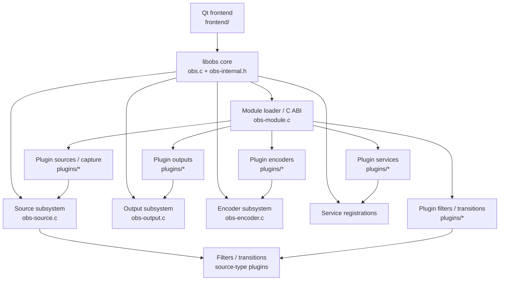

# Current OBS Studio Architecture

## Scope

This document summarizes the areas most relevant to an incremental Rust adoption plan. It is intentionally focused on `libobs/`, the plugin model under `plugins/`, and the Qt desktop frontend.

## `libobs` core

### Global runtime state

`libobs/obs.c` defines the process-wide `struct obs_core *obs`. The full `struct obs_core` definition is in `libobs/obs-internal.h`.

`struct obs_core` aggregates major runtime registries and services, including:

- Loaded and disabled modules.
- Module search paths and module allow/deny state.
- Registered source, input, filter, transition, output, encoder, and service types.
- Signal and procedure handlers.
- Locale and module configuration state.
- `obs_core_video` for graphics/video processing state.
- `obs_core_audio` for audio graph and monitoring state.
- `obs_core_data` for live sources, outputs, encoders, services, displays, canvases, callbacks, and synchronization primitives.
- `obs_core_hotkeys` for hotkey registration, bindings, platform polling, and callbacks.

This central ownership model means that large portions of `libobs` share native data structures, pthread synchronization, callback tables, and lifetime rules. Those boundaries should be treated as stable C interfaces during early Rust adoption.

### Sources

`libobs/obs-source.c` implements source lookup and source lifecycle behavior around `struct obs_source_info` registrations stored in `obs->source_types`. Sources cover several conceptual plugin classes, including inputs, filters, transitions, and other source-like media nodes.

The source subsystem includes signal emission, settings and context management, audio/video processing, filter relationships, activation state, and plugin ownership lookup. It is tightly coupled to the real-time media graph and should not be an early migration target except for isolated helper logic.

### Outputs

`libobs/obs-output.c` implements output type lookup and output runtime behavior around `struct obs_output_info` registrations in `obs->output_types`.

Outputs represent streaming, recording, muxing, and related sinks. The subsystem handles encoded versus raw output modes, audio/video capability flags, service relationships, reconnect behavior, packet flow, and synchronization with encoders and services.

Because output behavior directly participates in real-time streaming and recording, any future Rust migration in this area must preserve packet timing, callback ordering, reconnect semantics, thread behavior, and ABI-visible structures.

### Encoders

`libobs/obs-encoder.c` implements encoder type lookup and encoder object creation around `struct obs_encoder_info` registrations in `obs->encoder_types`.

Encoder objects are inserted into the core encoder list, use explicit mutexes and atomic active-state handling, and interact with video or audio pipelines, outputs, timestamps, and plugin-provided encoder callbacks.

Hardware and software encoders supplied by plugins remain native dependency boundaries even if orchestration code is eventually migrated.

### Module loading and plugin ABI

`libobs/obs-module.c` loads native modules with the platform dynamic-loader abstraction and resolves required C symbols. At minimum, a loadable module must expose:

- `obs_module_load`
- `obs_module_set_pointer`
- `obs_module_ver`

Optional module exports include unload, post-load, locale, metadata, and string functions. `libobs/obs-internal.h` stores these exports as C function pointers in `struct obs_module` and tracks the source/output/encoder/service IDs associated with each module.

This loader is a hard compatibility boundary. Rust implementations that replace or supplement native internals must preserve the expected C symbol names, calling conventions, type layouts, ownership rules, and version behavior wherever existing C/C++ code or third-party binary plugins cross the boundary.

## Plugin structure

`plugins/CMakeLists.txt` assembles a broad set of cross-platform and platform-specific native modules. Representative groups include:

### Source and capture plugins

- `plugins/image-source/`
- `plugins/linux-capture/`
- `plugins/linux-pipewire/`
- `plugins/linux-v4l2/`
- `plugins/mac-avcapture/`
- `plugins/mac-capture/`
- `plugins/win-capture/`
- `plugins/win-dshow/`

### Encoder and codec plugins

- `plugins/coreaudio-encoder/`
- `plugins/mac-videotoolbox/`
- `plugins/obs-ffmpeg/`
- `plugins/obs-libfdk/`
- `plugins/obs-nvenc/`
- `plugins/obs-qsv11/`
- `plugins/obs-x264/`

### Output, service, filter, and transition plugins

- `plugins/obs-outputs/`
- `plugins/rtmp-services/`
- `plugins/obs-filters/`
- `plugins/nv-filters/`
- `plugins/obs-transitions/`
- `plugins/obs-webrtc/`

### Frontend-oriented plugins

- `plugins/frontend-tools/`
- `plugins/aja-output-ui/`
- `plugins/decklink-output-ui/`

The plugin tree demonstrates why migration suitability must be decided plugin by plugin: some modules are thin native SDK adapters, some contain codec or protocol logic, and others are directly tied to OS multimedia stacks.

## Qt frontend

On current `master`, the desktop frontend is under `frontend/`; older references may call this directory `UI/`. It contains Qt-facing C++ code and `.ui` forms such as `frontend/forms/OBSBasic.ui`.

For this migration plan, the frontend is considered a native boundary rather than a Rust migration target. Rust components may be called from the frontend through C-compatible or carefully designed C++/Rust bridging layers, but replacing Qt or rewriting the application shell is an explicit non-goal.

## Boundary diagram

## Migration implication

The architecture favors **inside-out, boundary-preserving migration**. Rust should first appear behind narrow internal C-callable interfaces. The public/native extension boundary remains C. Media-critical subsystems should only be considered after utility and control-plane migrations establish proven build, test, ownership, panic, and FFI conventions.
